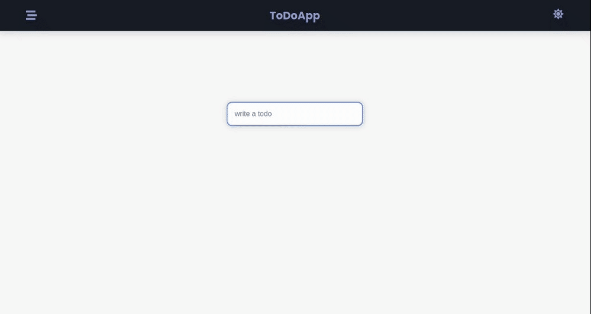

# LarnU Fullstack Bootcamp

## INTRO TO REACT

FullStack React TodoList with Typescript project using hooks and controlled components, PreferredTheme can be saved in localStorage. Express, mongoDB, mongoose to store todosList.

ThemeProvider que guarda el thema (light ó dark mode) favorito del usuario en localStorage más TodosProvider, usando Typescript, react, createContext, custom hooks y variables CSS para controlar el cambio entre light mode y dark mode

- npm i
- npm run dev

